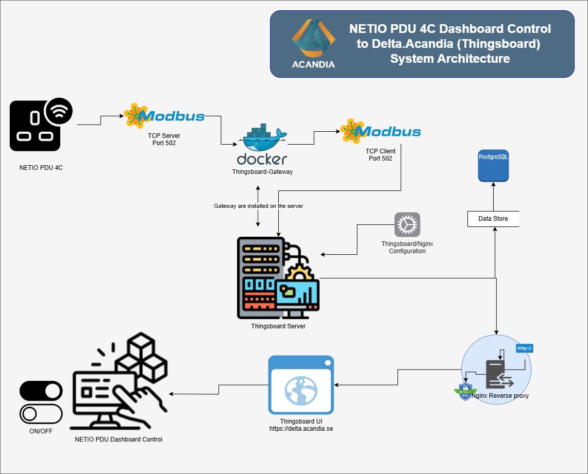

# 🔌 NETIO PDU 4C Dashboard Control with ThingsBoard via Modbus

This repository demonstrates how to integrate and control a **NETIO PowerPDU 4C** over **Modbus TCP** using **ThingsBoard**, an open-source IoT platform. This project highlights how to read telemetry data and control power outputs directly through a custom dashboard.

---

## 🎯 Purpose

The goal of this integration is to **remotely control and monitor a NETIO PowerPDU 4C device from outside the default NETIO web interface**, using a **custom-built dashboard inside the `delta.acandia` ThingsBoard instance**.

This solution provides:
- Centralized **visibility of electrical parameters** like voltage, current, power, frequency, and power factor.
- Remote **power output management** (ON/OFF/TOGGLE) per socket.
- Integration into a larger IoT ecosystem for future expansion (alerts, reports, automation, etc.).
- A practical alternative interface for environments where the default NETIO web UI is not suitable or accessible.

By using **Modbus TCP**, this setup ensures robust industrial-grade communication, enabling seamless real-time data synchronization between the physical PDU and the ThingsBoard interface hosted at `delta.acandia`.

---

## 🗺️ System Architecture

The system architecture is illustrated in the diagram above. It consists of the following main components:

1. **NETIO PDU 4C**
   - Power distribution unit with TCP server support over Modbus (Port 502)
   - Provides power consumption data and allows remote control via Modbus TCP

2. **ThingsBoard Gateway (Docker)**
   - Installed on the server to bridge Modbus data from the NETIO PDU 4C to ThingsBoard
   - Manages data forwarding to the ThingsBoard server

3. **ThingsBoard Server**
   - Central IoT platform for data visualization and device management
   - Receives data from the ThingsBoard Gateway and stores it in the PostgreSQL database

4. **PostgreSQL Database**
   - Stores telemetry data and configuration settings for ThingsBoard

5. **Nginx Reverse Proxy**
   - Secures communication with the ThingsBoard server using SSL/TLS
   - Routes external requests to the correct internal services

6. **ThingsBoard UI**
   - Web interface for monitoring and controlling PDU devices
   - Hosted at [https://delta.acandia.se](https://delta.acandia.se)

7. **NETIO PDU Dashboard Control**
   - Custom control panel for managing power outlets and monitoring real-time data

---

## 📸 Screenshots

<table>
  <tr>
    <td></td>
    <td></td>
  </tr>
  <tr>
    <td align="center">📊 Real-time Dashboard</td>
    <td align="center">📅 Telemetry View</td>
  </tr>
  <tr>
    <td></td>
    <td></td>
  </tr>
  <tr>
    <td align="center">👡️ Output Control Switches</td>
    <td align="center">🔌 NETIO PowerPDU 4C Device</td>
  </tr>
</table>

---

## 🧰 About NETIO PDU 4C

The **NETIO PowerPDU 4C** is a smart power distribution unit with four individually controllable IEC-320 C13 power outputs. It supports multiple M2M protocols including **Modbus TCP**, MQTT, SNMP, and more. Designed for IT, AV, and industrial use, it allows remote switching, power measurement, and automation integration.

Key Features:
- 4x switchable power outputs (socket control)
- Power metering per output (depending on model)
- Industrial-grade M2M communication protocols
- API and local web interface

Useful Register Map (from [NETIO Modbus TCP API Manual](./NETIO-Modbus-TCP_M2M-API-Protocol.pdf)):

| Function                  | Register Address | Type   | Description                                    |
|---------------------------|------------------|--------|------------------------------------------------|
| Power grid frequency     | 0                | `uInt16` | x100 Hz                                       |
| Voltage RMS              | 1                | `uInt16` | x10 Volts                                     |
| True Power Factor        | 2                | `uInt16` | /1000                                          |
| Current (all outputs)    | 100              | `uInt16` | mA                                             |
| Power (all outputs)      | 200              | `int16`  | Watts                                          |
| Output N State (R/W)     | 101-104          | `uInt16` | Read or set socket ON/OFF/TOGGLE state         |

---

## 🛠️ Technologies Used

- ⚙️ **Modbus TCP** (protocol for communication with the NETIO device)
- 📡 **ThingsBoard Community Edition v3.9.0**
- 🧠 **Custom Modbus configuration** for telemetry and RPC control
- 💻 **Custom Dashboard** with:
  - Power and current charts
  - Switch controls per output
  - Frequency and voltage visualizations

---

## 📦 Features

- ✅ Real-time visualization of:
  - Voltage (V)
  - Current (mA)
  - Power (W)
  - Frequency (Hz)
  - True Power Factor
- ✅ Switch control of 4 output ports (ON/OFF/TOGGLE)
- ✅ Telemetry collected via Modbus input and holding registers
- ✅ Remote management through ThingsBoard RPC

---

## 🧐 Author

**Alexander Flores**  
IoT & Embedded Systems Developer  
GitHub: [aalexanderfc](https://github.com/aalexanderfc)
