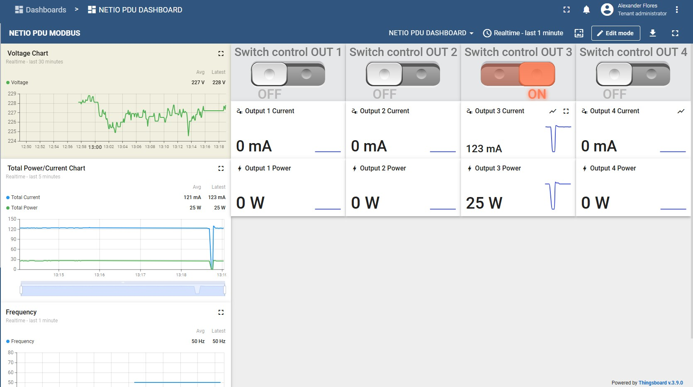
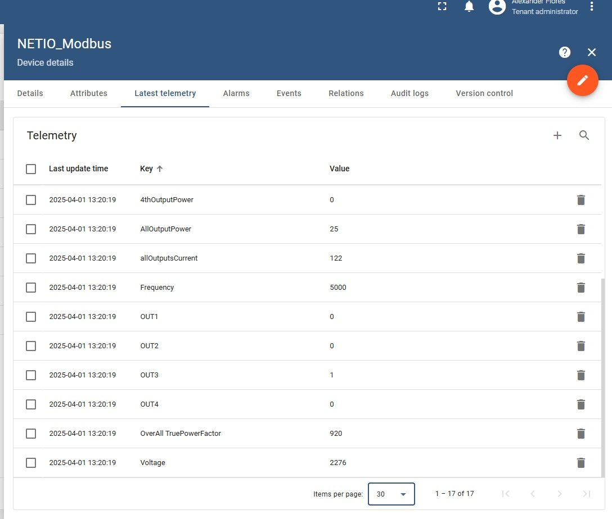
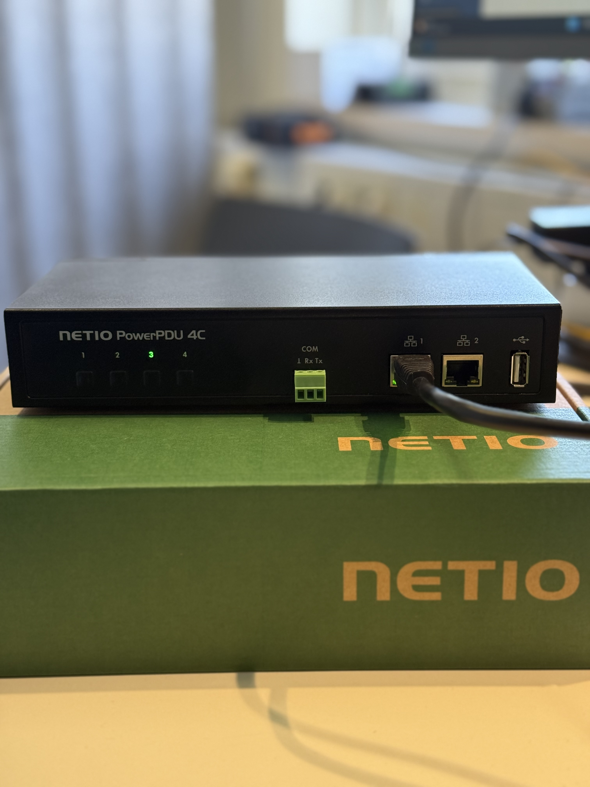
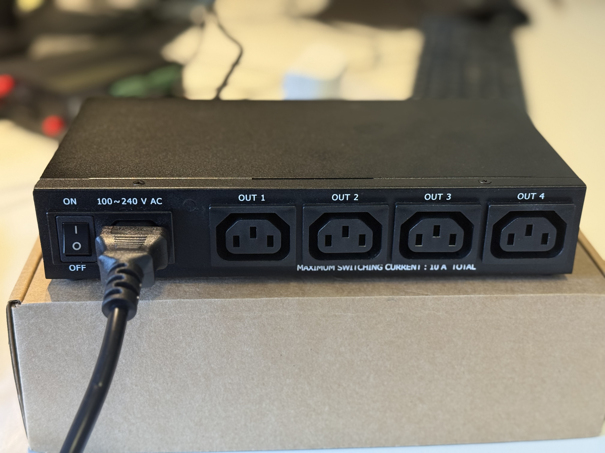

Absolutely! Here's the updated `README.md` with an extended **"Purpose"** section that clearly explains the intention behind the dashboard, including the context within the `delta.acandia` ThingsBoard environment.

---

# 🔌 NETIO PDU 4C Dashboard Control with ThingsBoard via Modbus

This repository demonstrates how to integrate and control a **NETIO PowerPDU 4C** over **Modbus TCP** using **ThingsBoard**, an open-source IoT platform. This project highlights how to read telemetry data and control power outputs directly through a custom dashboard.

---

## 🎯 Purpose

The goal of this integration is to **remotely control and monitor a NETIO PowerPDU 4C device from outside the default NETIO web interface**, using a **custom-built dashboard inside the `delta.acandia` ThingsBoard instance**.

This solution provides:
- Centralized **visibility of electrical parameters** like voltage, current, power, frequency, and power factor.
- Remote **power output management** (ON/OFF/TOGGLE) per socket.
- Integration into a larger IoT ecosystem for future expansion (alerts, reports, automation, etc.).
- A practical alternative interface for environments where the default NETIO web UI is not suitable or accessible.

By using **Modbus TCP**, this setup ensures robust industrial-grade communication, enabling seamless real-time data synchronization between the physical PDU and the ThingsBoard interface hosted at `delta.acandia`.

---

## 📸 Screenshots

<table>
  <tr>
    <td></td>
    <td></td>
  </tr>
  <tr>
    <td align="center">📊 Real-time Dashboard</td>
    <td align="center">📥 Telemetry View</td>
  </tr>
  <tr>
    <td></td>
    <td></td>
  </tr>
  <tr>
    <td align="center">🖱️ Output Control Switches</td>
    <td align="center">🔌 NETIO PowerPDU 4C Device</td>
  </tr>
</table>

---

## 🧰 Technologies Used

- ⚙️ **Modbus TCP** (protocol for communication with the NETIO device)
- 📡 **ThingsBoard Community Edition v3.9.0**
- 🧠 **Custom Modbus configuration** for telemetry and RPC control
- 💻 **Custom Dashboard** with:
  - Power and current charts
  - Switch controls per output
  - Frequency and voltage visualizations

---

## 📦 Features

- ✅ Real-time visualization of:
  - Voltage (V)
  - Current (mA)
  - Power (W)
  - Frequency (Hz)
  - True Power Factor
- ✅ Switch control of 4 output ports (ON/OFF/TOGGLE)
- ✅ Telemetry collected via Modbus input and holding registers
- ✅ Remote management through ThingsBoard RPC

---

## 🗺️ Modbus Configuration

The configuration was defined using:
- **Holding Registers (Function Code 03/06)** for Output control and status
- **Input Registers (Function Code 04)** for measurement telemetry

Example register mapping:

| Metric            | Register | Type   | Description             |
|-------------------|----------|--------|-------------------------|
| Voltage           | 2        | `uInt16` | Voltage (×10)           |
| Frequency         | 1        | `uInt16` | Frequency (×100)        |
| All Outputs Power | 5        | `int16`  | Power in Watts          |
| Output 1 Control  | 102      | `uInt16` | Control output (0–5)    |

---

## ⚡ Output Control Actions

Control outputs using RPC calls:
- `0` = OFF
- `1` = ON
- `4` = TOGGLE
- `2` = Short OFF
- `3` = Short ON

---

## 🧩 Dashboard Interaction

- Switches are configured via ThingsBoard widgets.
- Telemetry is visualized using real-time charts and historical data panels.
- Backend logic automatically processes Modbus register updates into readable telemetry.

---

## 🧠 Author

**Alexander Flores**  

